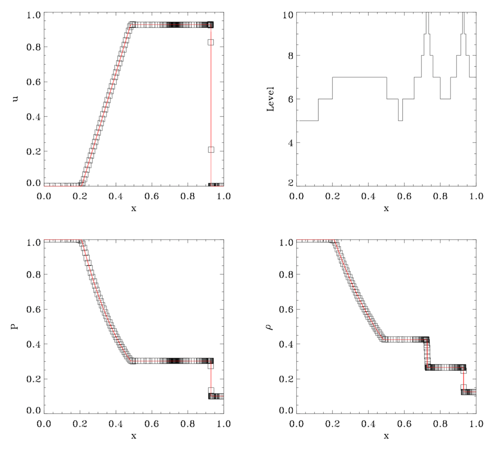

# Reading the log file

We  will now  briefly  describe the  structure and  the  nature of  the
information available in the log file. We will use as example the file
`tube.log` we have just created. It should contain, starting from the top:

```
 _/_/_/       _/_/     _/    _/    _/_/_/   _/_/_/_/    _/_/_/
 _/    _/    _/  _/    _/_/_/_/   _/    _/  _/         _/    _/
 _/    _/   _/    _/   _/ _/ _/   _/        _/         _/
 _/_/_/     _/_/_/_/   _/    _/     _/_/    _/_/_/       _/_/
 _/    _/   _/    _/   _/    _/         _/  _/               _/
 _/    _/   _/    _/   _/    _/   _/    _/  _/         _/    _/
 _/    _/   _/    _/   _/    _/    _/_/_/   _/_/_/_/    _/_/_/
                         Version 3.0
        written by Romain Teyssier (CEA/DSM/IRFU/SAP)
                      (c) CEA 1999-2007

 Working with nproc =    1 for ndim = 1
 Using the hydro solver with nvar =  3

 Building initial AMR grid
 Initial mesh structure
 Level  1 has          1 grids (       1,       1,       1,)
 Level  2 has          2 grids (       2,       2,       2,)
 Level  3 has          4 grids (       4,       4,       4,)
 Level  4 has          8 grids (       8,       8,       8,)
 Level  5 has          8 grids (       8,       8,       8,)
 Level  6 has          8 grids (       8,       8,       8,)
 Level  7 has          8 grids (       8,       8,       8,)
 Level  8 has          8 grids (       8,       8,       8,)
 Level  9 has          6 grids (       6,       6,       6,)
 Level 10 has          4 grids (       4,       4,       4,)
 Starting time integration
 Output    58 cells
 ================================================
 lev      x           d          u          P
  4  3.12500E-02  1.000E+00  0.000E+00  1.000E+00
  4  9.37500E-02  1.000E+00  0.000E+00  1.000E+00
...
  4  9.06250E-01  1.250E-01  0.000E+00  1.000E-01
  4  9.68750E-01  1.250E-01  0.000E+00  1.000E-01
 ================================================
 Fine step=     0 t= 0.00000E+00 dt= 6.603E-04 a= 1.000E+00 mem= 3.2%
 Fine step=     1 t= 6.60250E-04 dt= 4.420E-04 a= 1.000E+00 mem= 3.2%
```

After the  code banner and  copyrights, the first line  indicates that
you are  currently using 1  processor and  1 space dimension  for this
run.   The second  line confirms  the solver  used and  the number  of
variables  defined for  this run.  The code  then reports  that it  is
building the initial AMR grid. The  next lines give the resulting mesh
structure.

The first level of refinement in _ramses_ covers the whole computational 
domain with 2 (resp. 4 and 8) cells in 1 (resp. 2 and 3) space dimension.
The grid is then entirely refined up to `levelmin`, which in this case is
defined in the parameter file to be `levelmin=3`. This defines the 
_coarse grid_. The grid is then adaptively refined up to `levelmax`, which 
in this case `levelmax=10`. Each line in the log file indicates the 
number of octs (or grids) at each level of refinement. The maximum number
of grids in each level `level` is equal to `2**(level-1)` for `NDIM=1`,
to `4**(level-1)` for `NDIM=2` and to `8**(level-1)` for `NDIM=3`.

The numbers inside parentheses give the minimum, maximum and average 
number of grids per processor. This is obviously only relevant to 
parallel runs.

The code then indicates that the  time integration starts. After outputting
the initial  conditions to screen,  the first _control  line_ appears,
starting  with  the  words  `Fine   step=`.  The  control  line  gives
information on each _fine step_,  its current number, its current time
coordinate, its current time step.  Variable `a` is for cosmology runs
only and gives the current expansion factor.  The last variable is the
percentage of allocated memory currently  used by ramses to store each
flow variable on the grid.

In ramses,  adaptive time  stepping is  implemented, which  results in
defining _coarse steps_  and _fine steps_. Coarse  steps correspond to
the coarse grid, which is  defined by variable `levelmin`.  Fine steps
correspond  to  finer  levels,  for  which  the  time  step  has  been
recursively subdivided by  a factor of 2. Fine  levels are sub-cycled,
twice as more as their parent  coarse level. This explains why, at the
end of the log file, only 43 coarse steps are reported (1 through 43),
for 689 fine steps (numbered from 0 to 688).

When a  coarse step is  reached, the code writes  in the log  file the
current mesh  structure.  A  new control  line then  appears, starting
with the  words `Main step=`.  This control line gives  information on
each coarse step, namely its current number, the current error in mass
conservation within the computational  box `mcons=`, the current error
in  total energy  conservation `econs=`,  the gravitational  potential
energy and the fluid total energy (kinetic plus thermal).

This constitutes the  basic information contained in the  log file. In
1D simulations, output  data are also written to  standard output, and
thus to  the log  file. For  2D and  3D, output  data are  stored into
unformatted    Fortran    binary    files    (named    `output_00001`,
`output_00002`...).  In  our example,  the fluid variables  are listed
using 5 columns:  level of refinement, position of  the cell, density,
velocity and pressure:

```
 Output   142 cells
 ================================================
 lev      x           d          u          P
  5  1.56250E-02  1.000E+00  0.000E+00  1.000E+00
  5  4.68750E-02  1.000E+00  0.000E+00  1.000E+00
  5  7.81250E-02  1.000E+00  0.000E+00  1.000E+00
  5  1.09375E-01  1.000E+00  1.564E-09  1.000E+00
  6  1.32812E-01  1.000E+00  2.112E-08  1.000E+00
```

You can  cut and paste  the 142 lines into  another file and  use your
favorite  data viewer  like `xmgrace`  or `gnuplot`  to visualize  the
results.  These should be compared to  the plots shown on the figure below. If
you  have   obtained  comparable   numerical  values  and   levels  of
refinements,  your  installation  is  likely  to  be  valid.  You  are
encouraged to  edit the  parameter file  `tube1d.nml` and  play around
with   other   parameter  values,   in   order   to  test   the   code
performances.  You  can   also  use  other  parameter   files  in  the
`namelist/` directory

If you would like to run a 2D simulation (using file `sedov2d.nml` for 
example), do not forget to recompile entirely the code using:

```
$ cd trunk/ramses/bin
$ make clean
$ make NDIM=2
```

This last image shows the numerical results obtained with ramses for the Sod shock tube test (symbols) compared to the analytical solution (red line).



## [Back to the table of contents !](Content)

